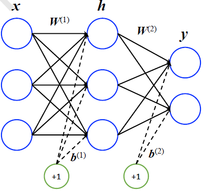
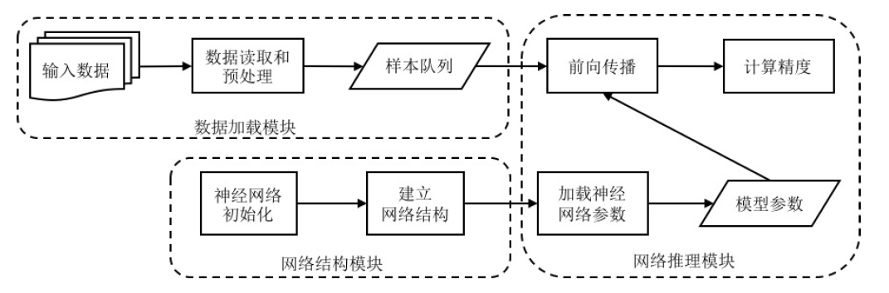
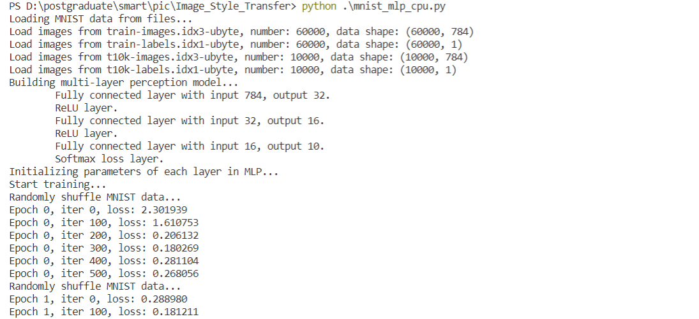
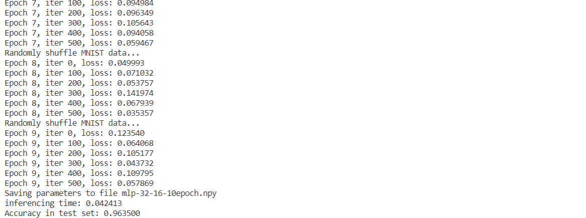
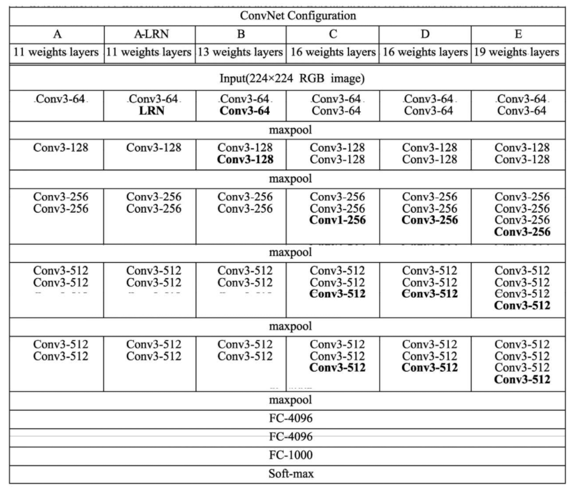
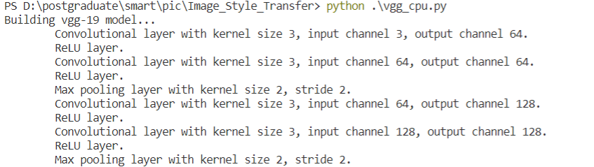
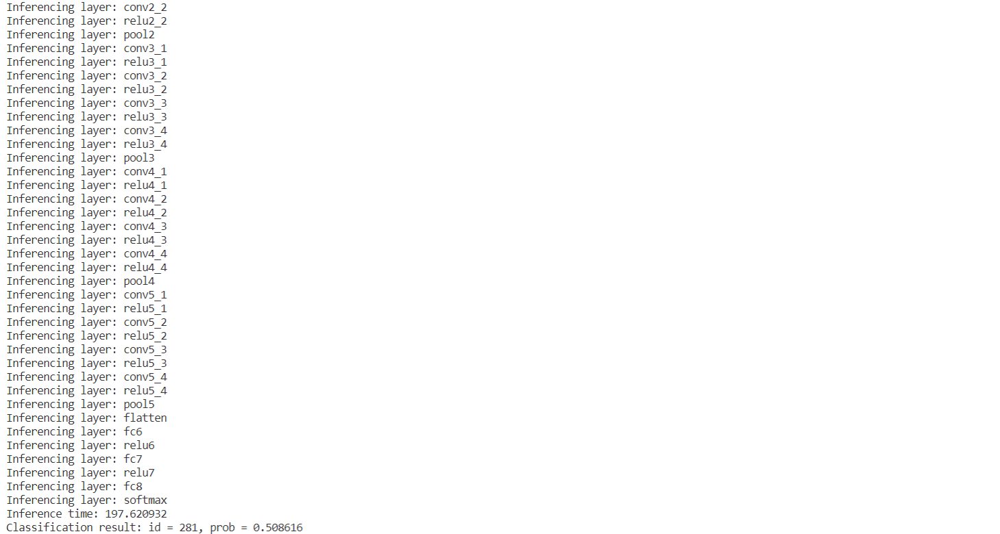
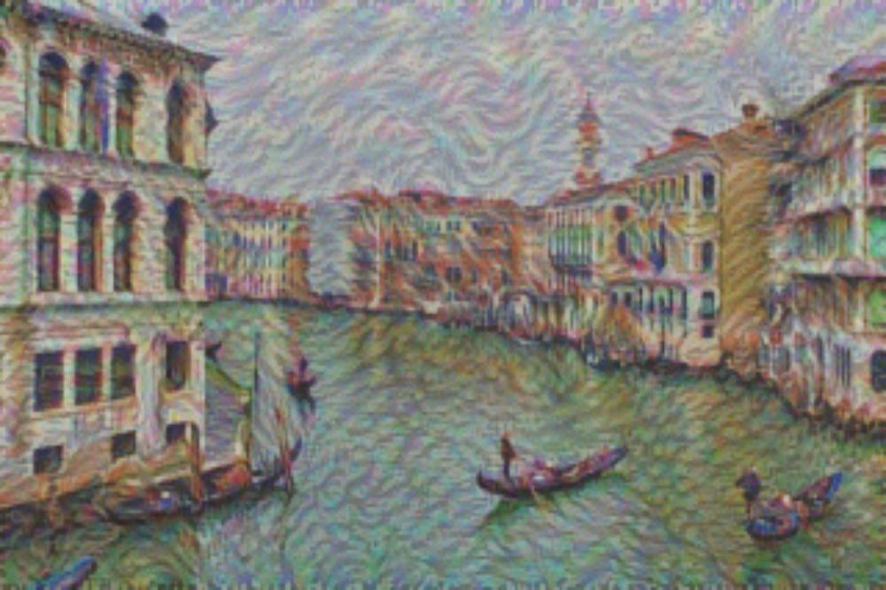
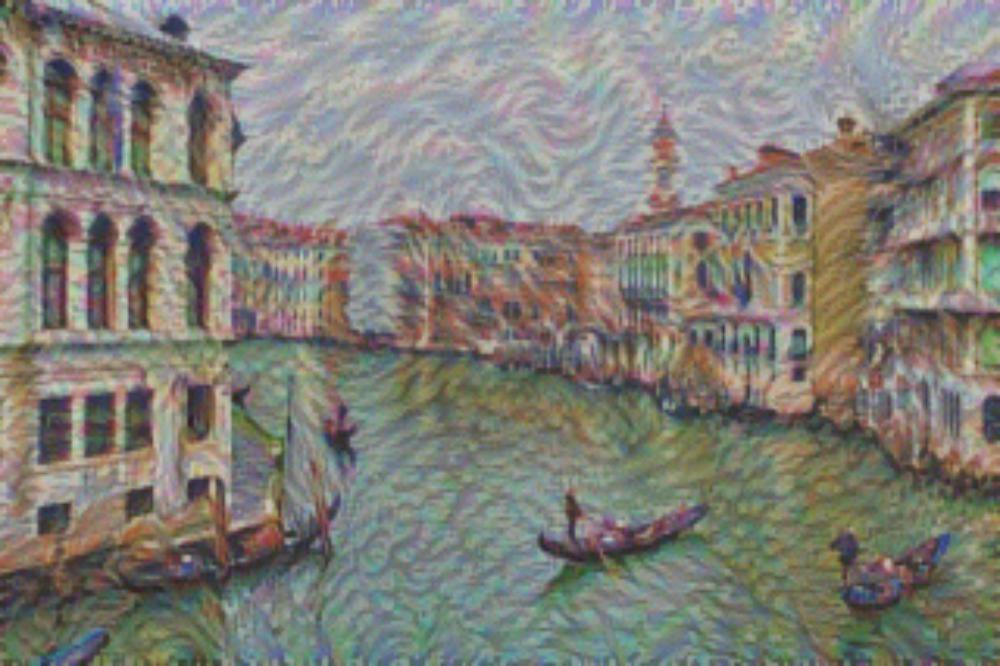

# Image_Style_Transfer 
realize image style transfer using basic components of neural network 
According to UCAS course: Intelligent Computing Systems 
<p align = 'center'>

</p>


# Basic NN Components [layers1](https://github.com/up-or-down/Image_Style_Transfer/blob/main/layers_1.py)
## FullyConnectedLayer：

<p align = 'center'>

</p>

### forward:
$$ \boldsymbol{y}=\boldsymbol{W}^{T}\boldsymbol{x}+\boldsymbol{b} $$

where  $\boldsymbol{x}\in{\mathbb{R}^m}$ is the input sample, 
$\boldsymbol{W}\in{\mathbb{R}^{m\times{n}}}$
is the weight matrix, 
$\boldsymbol{b}\in{\mathbb{R}^n}$ 
is the bias vector, 
and $\boldsymbol{y}\in{\mathbb{R}^n}$ 
is the output of fully connected layer.

### backward:
Define $\nabla_{\boldsymbol{y}} L $ as partial derivative of Loss function  $L$
to   ${\boldsymbol{y}}$ ("top_diff" in layers_1.py) 

$$ \nabla_{\boldsymbol{W}} L=x\nabla_{\boldsymbol{y}} L^T $$

$$ \nabla_{\boldsymbol{b}} L=\nabla_{\boldsymbol{y}} L $$

$$ \nabla_{\boldsymbol{x}} L=\boldsymbol{W}^T\nabla_{\boldsymbol{y}} L $$

### update parameters:
$$ \boldsymbol{W} = \boldsymbol{W}-\eta\nabla_{\boldsymbol{W}} L$$

$$ \boldsymbol{b}=\boldsymbol{b}-\eta\nabla_{\boldsymbol{b}} L $$


## ReLULayer：
### forward:
$$ \boldsymbol{y}(i)=\max{(0,\boldsymbol{x}(i))} $$
where $\boldsymbol{x}\in\mathbb{R}^{n}$ is the input of ReLU Layer,$\boldsymbol{y}\in\mathbb{R}^{n}$ is the output.

### backward:
The partial derivative of $L$ to 
$\boldsymbol{x}$(in this layer):

$$ 
\nabla_{\boldsymbol{x}(i)} L=\begin{cases}
\nabla_{\boldsymbol{y}(i)} L &\boldsymbol{x}(i)\geq0\\
0,&\boldsymbol{x}(i)<0
\end{cases}
$$


## SoftmaxLossLayer：
$$\boldsymbol{\hat{y}}(i) = \frac{e^{\boldsymbol{x}(i)}}{\Sigma_j{e^{\boldsymbol{x}(j)}}} $$

where  $\boldsymbol{x}(i)$  is the input of softmax layer, 
$\boldsymbol{\hat{y}}(i)$ is classification probability of position 
$i$ in softmax layer. When $e^{\boldsymbol{x}(i)}$ is too large, formula above can be converted to avoid numerical overflow.
$$\boldsymbol{\hat{y}}(i) = \frac{e^{\boldsymbol{x}(i)-\max\limits_{n}\boldsymbol{x}(n)}}{\sum\limits_{j}{e^{\boldsymbol{x}(j)-\max\limits_{n}\boldsymbol{x}(n)}}} $$
### forward:
The loss function of softmax layer is defined as:

$$ L = -\sum\limits_{i}\boldsymbol{y}(i)\ln\boldsymbol{\hat{y}}(i)$$

where  $\boldsymbol{y}(i)$  is the position
$i$ of label vector $\boldsymbol{y}$.

Considering batch processing:
$$ L = -\frac{1}{p}\sum\limits_{i,j}\boldsymbol{Y}(i,j)\ln\boldsymbol{\hat{Y}}(i,j)$$
where $\boldsymbol{Y}(i,j)$ is the position 
$(i,j)$ 
of label matrix $\boldsymbol{Y}\in{\mathbb{R}^{p\times{n}}}$
,every row vector of $\boldsymbol{\hat{Y}}\in{\mathbb{R}^{p\times{n}}}$ corresponds to output of one sample in softmax layer. 
$$\boldsymbol{\hat{Y}}(i,j)=\frac{e^{\boldsymbol{X}(i,j)-\max\limits_{n}\boldsymbol{X}(i,n)}}{\sum\limits_{l}{e^{\boldsymbol{X}(l,j)-\max\limits_{n}\boldsymbol{X}(l,n)}}}$$

$\boldsymbol{X}=\{\boldsymbol{x_1},\boldsymbol{x_2},...,\boldsymbol{x_p}\}^T $


### backward:
The partial derivative of $L$ to 
$\boldsymbol{x}$ in this layer:
$$\nabla_{\boldsymbol{x}}L = \boldsymbol{\hat{y}}-\boldsymbol{y} $$

Considering batch processing:
$$\nabla_{\boldsymbol{X}}L = \frac{1}{p}(\boldsymbol{\hat{Y}}-\boldsymbol{Y} )$$

# Demo1 [MNIST Classification](https://github.com/up-or-down/Image_Style_Transfer/blob/main/mnist_mlp_cpu.py)
## Load MNIST dataset:
```py
import struct
import numpy as np
MNIST_DIR = "../mnist_data"
TRAIN_DATA = "train-images-idx3-ubyte"
TRAIN_LABEL = "train-labels-idx1-ubyte"
TEST_DATA = "t10k-images-idx3-ubyte"
TEST_LABEL = "t10k-labels-idx1-ubyte"

def load_mnist(file_dir, is_images = 'True'):
    # Read binary data
    bin_file = open(file_dir, 'rb')
    bin_data = bin_file.read()
    bin_file.close()
    # Analyze file header
    if is_images:
        # Read images
        fmt_header = '>iiii'
        magic, num_images, num_rows, num_cols = struct.unpack_from(fmt_header, bin_data, 0)
    else:
        # Read labels
        fmt_header = '>ii'
        magic, num_images = struct.unpack_from(fmt_header, bin_data, 0)
        num_rows, num_cols = 1, 1
    data_size = num_images * num_rows * num_cols
    mat_data = struct.unpack_from('>' + str(data_size) + 'B', bin_data, struct.calcsize(fmt_header))
    mat_data = np.reshape(mat_data, [num_images, num_rows * num_cols])
    print('Load images from %s, number: %d, data shape: %s' % (file_dir, num_images, str(mat_data.shape)))
    return mat_data

train_images = load_mnist(TRAIN_DATA, True)
train_labels = load_mnist(TRAIN_LABEL, False)
test_images = load_mnist(TEST_DATA, True)
test_labels = load_mnist(TEST_LABEL, False)
```
<p align = 'center'>

</p>

## Result:
<p align = 'center'>

</p>
<p align = 'center'>

</p>

# Basic CNN Components [layers2](https://github.com/up-or-down/Image_Style_Transfer/blob/main/layers2.py)

<p align = 'center'>

VGG16 Architecture
</p>

In this section,we use VGG19 instead of VGG16.

<table align="center" style="width:100%; border:#000 solid; border-width:2.5px 0">
<caption>Table.1 VGG19 Architecture </caption>
<thead style="border-bottom:#000 1px solid;">
<tr>
<th style="border:0">Name</th>
<th style="border:0">Type</th>
<th style="border:0">Kernel Size</th>
<th style="border:0">Stride</th>
<th style="border:0">Padding Size</th>
<th style="border:0">Cin</th>
<th style="border:0">Cout</th>
<th style="border:0">K</th>
</tr>
</thead>
<tr>
<td style="border:0">conv1_1</td>
<td style="border:0">Conv</td>
<td style="border:0">3</td>
<td style="border:0">1</td>
<td style="border:0">1</td>
<td style="border:0">3</td>
<td style="border:0">64</td>
<td style="border:0">224</td>
</tr>
<tr>
<td style="border:0">conv1_2</td>
<td style="border:0">Conv</td>
<td style="border:0">3</td>
<td style="border:0">1</td>
<td style="border:0">1</td>
<td style="border:0">64</td>
<td style="border:0">64</td>
<td style="border:0">224</td>
</tr>
<thead style="border-bottom:#000 1px solid;">
<tr>
<td style="border:0">pool1</td>
<td style="border:0">MaxPool</td>
<td style="border:0">2</td>
<td style="border:0">2</td>
<td style="border:0">-</td>
<td style="border:0">64</td>
<td style="border:0">64</td>
<td style="border:0">112</td>
</tr>
</thead>
<tr>
<td style="border:0">conv2_1</td>
<td style="border:0">Conv</td>
<td style="border:0">3</td>
<td style="border:0">1</td>
<td style="border:0">1</td>
<td style="border:0">64</td>
<td style="border:0">128</td>
<td style="border:0">112</td>
</tr>
<tr>
<td style="border:0">conv2_2</td>
<td style="border:0">Conv</td>
<td style="border:0">3</td>
<td style="border:0">1</td>
<td style="border:0">1</td>
<td style="border:0">128</td>
<td style="border:0">128</td>
<td style="border:0">112</td>
</tr>
<thead style="border-bottom:#000 1px solid;">
<tr>
<td style="border:0">pool2</td>
<td style="border:0">MaxPool</td>
<td style="border:0">2</td>
<td style="border:0">2</td>
<td style="border:0">-</td>
<td style="border:0">128</td>
<td style="border:0">128</td>
<td style="border:0">56</td>
</tr>
</thead>
<tr>
<td style="border:0">conv3_1</td>
<td style="border:0">Conv</td>
<td style="border:0">3</td>
<td style="border:0">1</td>
<td style="border:0">1</td>
<td style="border:0">128</td>
<td style="border:0">256</td>
<td style="border:0">56</td>
</tr>
<tr>
<td style="border:0">conv3_2</td>
<td style="border:0">Conv</td>
<td style="border:0">3</td>
<td style="border:0">1</td>
<td style="border:0">1</td>
<td style="border:0">256</td>
<td style="border:0">256</td>
<td style="border:0">56</td>
</tr>
<tr>
<td style="border:0">conv3_3</td>
<td style="border:0">Conv</td>
<td style="border:0">3</td>
<td style="border:0">1</td>
<td style="border:0">1</td>
<td style="border:0">256</td>
<td style="border:0">256</td>
<td style="border:0">56</td>
</tr>
<tr>
<td style="border:0">conv3_4</td>
<td style="border:0">Conv</td>
<td style="border:0">3</td>
<td style="border:0">1</td>
<td style="border:0">1</td>
<td style="border:0">256</td>
<td style="border:0">256</td>
<td style="border:0">56</td>
</tr>
<thead style="border-bottom:#000 0.5px solid;">
<tr>
<td style="border:0">pool3</td>
<td style="border:0">MaxPool</td>
<td style="border:0">2</td>
<td style="border:0">2</td>
<td style="border:0">-</td>
<td style="border:0">256</td>
<td style="border:0">256</td>
<td style="border:0">28</td>
</tr>
</thead>
<tr>
<td style="border:0">conv4_1</td>
<td style="border:0">Conv</td>
<td style="border:0">3</td>
<td style="border:0">1</td>
<td style="border:0">1</td>
<td style="border:0">256</td>
<td style="border:0">512</td>
<td style="border:0">28</td>
</tr>
<tr>
<td style="border:0">conv4_2</td>
<td style="border:0">Conv</td>
<td style="border:0">3</td>
<td style="border:0">1</td>
<td style="border:0">1</td>
<td style="border:0">512</td>
<td style="border:0">512</td>
<td style="border:0">28</td>
</tr>
<tr>
<td style="border:0">conv4_3</td>
<td style="border:0">Conv</td>
<td style="border:0">3</td>
<td style="border:0">1</td>
<td style="border:0">1</td>
<td style="border:0">512</td>
<td style="border:0">512</td>
<td style="border:0">28</td>
</tr>
<tr>
<td style="border:0">conv4_4</td>
<td style="border:0">Conv</td>
<td style="border:0">3</td>
<td style="border:0">1</td>
<td style="border:0">1</td>
<td style="border:0">512</td>
<td style="border:0">512</td>
<td style="border:0">28</td>
</tr>
<thead style="border-bottom:#000 1px solid;">
<tr>
<td style="border:0">pool4</td>
<td style="border:0">MaxPool</td>
<td style="border:0">2</td>
<td style="border:0">2</td>
<td style="border:0">-</td>
<td style="border:0">512</td>
<td style="border:0">512</td>
<td style="border:0">14</td>
</tr>
</thead>
<tr>
<td style="border:0">conv5_1</td>
<td style="border:0">Conv</td>
<td style="border:0">3</td>
<td style="border:0">1</td>
<td style="border:0">1</td>
<td style="border:0">512</td>
<td style="border:0">512</td>
<td style="border:0">14</td>
</tr>
<tr>
<td style="border:0">conv5_2</td>
<td style="border:0">Conv</td>
<td style="border:0">3</td>
<td style="border:0">1</td>
<td style="border:0">1</td>
<td style="border:0">512</td>
<td style="border:0">512</td>
<td style="border:0">14</td>
</tr>
<tr>
<td style="border:0">conv5_3</td>
<td style="border:0">Conv</td>
<td style="border:0">3</td>
<td style="border:0">1</td>
<td style="border:0">1</td>
<td style="border:0">512</td>
<td style="border:0">512</td>
<td style="border:0">14</td>
</tr>
<tr>
<td style="border:0">conv5_4</td>
<td style="border:0">Conv</td>
<td style="border:0">3</td>
<td style="border:0">1</td>
<td style="border:0">1</td>
<td style="border:0">512</td>
<td style="border:0">512</td>
<td style="border:0">14</td>
</tr>
<thead style="border-bottom:#000 1px solid;">
<tr>
<td style="border:0">pool5</td>
<td style="border:0">MaxPool</td>
<td style="border:0">2</td>
<td style="border:0">2</td>
<td style="border:0">-</td>
<td style="border:0">512</td>
<td style="border:0">512</td>
<td style="border:0">7</td>
</tr>
</thead>
<tr>
<td style="border:0">fc6</td>
<td style="border:0">FCL</td>
<td style="border:0">-</td>
<td style="border:0">-</td>
<td style="border:0">-</td>
<td style="border:0">512*7*7</td>
<td style="border:0">4096</td>
<td style="border:0">1</td>
</tr>
<tr>
<td style="border:0">fc7</td>
<td style="border:0">FCL</td>
<td style="border:0">-</td>
<td style="border:0">-</td>
<td style="border:0">-</td>
<td style="border:0">4096</td>
<td style="border:0">4096</td>
<td style="border:0">1</td>
</tr>
<tr>
<td style="border:0">fc8</td>
<td style="border:0">FCL</td>
<td style="border:0">-</td>
<td style="border:0">-</td>
<td style="border:0">-</td>
<td style="border:0">4096</td>
<td style="border:0">1000</td>
<td style="border:0">1</td>
</tr>
<tr>
<td style="border:0">softmax</td>
<td style="border:0">Softmax</td>
<td style="border:0">-</td>
<td style="border:0">-</td>
<td style="border:0">-</td>
<td style="border:0">-</td>
<td style="border:0">-</td>
<td style="border:0">-</td>
</tr>
</table>

## ConvolutionalLayer
Convolution Kernel $\boldsymbol{W}\in\mathbb{R}^{C_{in}\times{K}\times{K}\times{C_{out}}}$.
$C_{in}$ is the number of input channels,
$K$ is kernel size,
$C_{out}$ is the number of output channels.

The input feature map  $X\in\mathbb{R}^{N\times{C_{in}}\times{H_{in}}\times{W_{in}}}$.
$N$ is the number of input samples.
$H_{in}$ and $W_{in}$ is height and width of feature map. Likely, the output feature map is $N\times{C_{out}}\times{H_{out}}\times{W_{out}}$. In addition, $p$ is padding size and $s$ is stride.

To obtain expected output in each layer, after image padding:

$$\boldsymbol{X}_{pad}(n,c_{in},h,w)=\begin{cases}
\boldsymbol{X}(n,c_{in},h-p,w-p) &p\le{h}\le{p+H_{in}},p\le{w}\le{p+W_{in}}\\
0 &otherwise
\end{cases}$$

Apply convolution operation to $\boldsymbol{X}_{pad}$:

$$\boldsymbol{Y}(n,c_{out},h,w)=\sum\limits_{c_{in}}\sum\limits_{k_h}\sum\limits_{k_w}\boldsymbol{W}(c_{in},k_h,k_w,c_{out})\boldsymbol{X}_{pad}(n,c_{in},hs+k_h,ws+k_w)+\boldsymbol{b}(c_{out})$$

### backward:
Define $L$ as loss function and 
$\nabla_{\boldsymbol{Y}}L$ as partial derivative of 
$L$ to output of current layer.

$$\nabla_{\boldsymbol{W}(c_{in},k_h,k_w,c_{out})}L=\sum\limits_{n,h,w}\nabla_{\boldsymbol{Y}(n,c_{out},h,w)}L\boldsymbol{X}_{pad}(n,c_{in},hs+k_h,ws+k_w) $$
$$\nabla_{\boldsymbol{b}(j)}L=\sum\limits_{n,h,w}\nabla_{\boldsymbol{Y}(n,c_{out},h,w)}L $$
$$\nabla_{\boldsymbol{X}_{pad}(n,c_{in},hs+k_h,ws+k_w)}L=\sum\limits_{c_{out}}\nabla_{\boldsymbol{Y}(n,c_{out},h,w)}L\boldsymbol{W}(c_{in},k_h,k_w,c_{out}) $$
Remove padded ：
$$\nabla_{\boldsymbol{X}}L(n,c_{in},h,w)=\nabla_{\boldsymbol{X}_{pad}}L(n,c_{in},h+p,w+p) $$

## MaxPoolingLayer
The input of max pooling $\boldsymbol{X}\in\mathbb{R}^{N\times{C}\times{H_{in}}\times{W_{in}}}$ 
and the output $\boldsymbol{Y}\in\mathbb{R}^{N\times{C}\times{H_{out}}\times{W_{out}}}$,
$$\boldsymbol{Y}(n,c,h,w) =\max\limits_{k_h,k_w\in{[1,K]}}\boldsymbol{X}(n,c,hs+k_h,ws+k_w)$$
### backward:
$\nabla_{\boldsymbol{Y}}L\in{\mathbb{R}^{N\times{C}\times{H_{out}}\times{W_{out}}}}$ represents partial derivative of $L$ to output of max pooling layer.Considering max pooling has altered the shape of the feature map,find out the coordinate corresponding to max pooling window:
$$p(n,c,h,w)=[k_h,k_w]=arg\\max_{k_h,k_w}\boldsymbol{X}(n,c,hs+k_h,ws+k_w)$$
$$\nabla_{\boldsymbol{X}(n,c,hs+k_h,ws+k_w)}L=\nabla_{\boldsymbol{Y}}L(n,c,h,w) $$


# Demo2 [VGG19-based ImageNet Classification](https://github.com/up-or-down/Image_Style_Transfer/blob/main/vgg_cpu.py)
## Load ImageNet dataset:
Standard model can be acquired from [vgg](https://www.vlfeat.org/matconvnet/models/beta16/imagenet-vgg-verydeep-19.mat),so official dataset is unnecessary.
Code for loading test pictures as follows:
```py
def load_image(image_dir):
    input_image = scipy.misc.imread(image_dir)
    input_image = scipy.misc.imresize(input_image,[224,224,3]) #unifies the size of the input
    input_image = np.array(input_image).astype(np.float32) #quantification
    input_image -= image_mean #separately calculated
    input_image = np.reshape(input_image,[1]+list(input_image.shape)) #input dim:[N=1,height=224,width=224,channel=3]
    input_image = np.transpose(input_image,[0,3,1,2]) #input dim:[N=1,channel=3,height=224,width=224]
```
## Result
<p align = 'center'>

</p>
<p align = 'center'>

</p>

Classification result id=281,class category refers to 
[here](https://blog.csdn.net/weixin_43269994/article/details/122139810)

# Demo3 Image Style Transfer(not real-time)[layers3](https://github.com/up-or-down/Image_Style_Transfer/blob/main/layers3.py)
## Content Loss
Suppose $\boldsymbol{X}^l\in{\mathbb{R}^{N\times{C}\times{H}\times{W}}}$ 
is the $l_{th}$
feature map of style transfer image, and $\boldsymbol{Y}^l\in{\mathbb{R}^{N\times{C}\times{H}\times{W}}}$
is the $l_{th}$
feature map of targeted content image.Centent loss can be represented by ${\boldsymbol{X}^l}$
and ${\boldsymbol{Y}^l}$.
$$L_{content}=\frac{1}{2NCHW}\sum\limits_{n,c,h,w}(\boldsymbol{X}^l(n,c,h,w)-\boldsymbol{Y}^l(n,c,h,w))^2$$
The content loss is the average Euclidean distance of all positions in feature maps.
The gradient of content loss to feature map can be calculated by:
$$\nabla_{\boldsymbol{X}^l}L_{content}(n,c,h,w)=\frac{1}{NCHW}(\boldsymbol{X}^l(n,c,h,w)-\boldsymbol{Y}^l(n,c,h,w))$$
In experiment, feature map of content image is chosen from output of ReLU layer after conv4_2.
## Style Loss
Suppose $\boldsymbol{X}^l\in{\mathbb{R}^{N\times{C}\times{H}\times{W}}}$
is the $l_{th}$ 
feature map of style transfer image, and $\boldsymbol{Y}^l\in{\mathbb{R}^{N\times{C}\times{H}\times{W}}}$ 
is the $l_{th}$ 
feature map of targeted content image. In forward propagation,the style feature of style transfer image $(\boldsymbol{G})$ 
and targeted style image $(\boldsymbol{A})$ 
are calculated with Gram moment:
$$\boldsymbol{G}^l(n,i,j)=\sum\limits_{h,w}\boldsymbol{X}^l(n,i,h,w)\boldsymbol{X}^l(n,j,h,w) $$
$$\boldsymbol{A}^l(n,i,j)=\sum\limits_{h,w}\boldsymbol{Y}^l(n,i,h,w)\boldsymbol{Y}^l(n,j,h,w) $$
where $n\in[1,N]$
indicates one sample,$i,j\in[1,C]$
corresponds to one channel.The style loss of $l_{th}$ layer:
$$L_{style}^l=\frac{1}{4NC^2H^2W^2}\sum\limits_{n,i,j}(\boldsymbol{G}^l(n,i,j)-\boldsymbol{A}^l(n,i,j))^2 $$
The overall style loss is the weighted sum of style loss in each layer.
$$L_{style}=\sum\limits_{l}w_lL_{style}^l $$
In backward propagation,the gradient of $L_{style}^l$ 
to $\boldsymbol{X}^l$:
$$\nabla_{\boldsymbol{X}^l}L_{style}^l(n,i,h,w)=\frac{1}{NC^2H^2W^2}\sum\limits_{j}\boldsymbol{X}^l(n,j,h,w)(\boldsymbol{G}^l(n,j,i)-\boldsymbol{A}^l(n,j,i)) $$
Based on content loss and style loss, the total loss can be represented as:
$$L_{total}=\alpha{L_{content}+\beta{L_{style}}} $$
## Adam Optimizer
To train neural network,batch random gradient descent is used to update network parameters.In experiment,Adam algorithom is used instead of batch random gradient descent, because it converges faster.
Parameter updating：
$$m_t=\beta_1m_{t-1}+(1-\beta_1)\nabla_{\boldsymbol{X}}L $$
$$v_t=\beta_2v_{t-1}+(1-\beta_2)\nabla_{\boldsymbol{X}}L^2 $$
$$\hat{m_t}=\frac{m_t}{1-\beta_1^t} $$
$$\hat{v_t}=\frac{v_t}{1-\beta_2^t} $$
$$\boldsymbol{X}\leftarrow\boldsymbol{X}-\eta\frac{\hat{m_t}}{\sqrt{\hat{v_t}}+\epsilon} $$
where $m_t$
is estimition of the order one moment of gradient, $v_t$
is that of the order two. $\hat{m_t}$
and $\hat{v_t}$ is unbiased estimition.
## Result:
<p align = 'center'>

<br/>
content figure
</p>
<p align = 'center'>

<br/>
style figure
</p>

<div align="center">
      

<font>epoch 10</font>
&emsp;&emsp;&emsp;&emsp;&emsp;&emsp;&emsp;&emsp;&emsp;&emsp;&emsp;
<font>epoch 20</font>
&emsp;&emsp;&emsp;&emsp;&emsp;&emsp;&emsp;&emsp;&emsp;&emsp;&emsp;
<font>epoch 30</font>
&emsp;&emsp;&emsp;&emsp;&emsp;&emsp;&emsp;&emsp;&emsp;&emsp;&emsp;
<font>epoch 40</font>
</div>

Note: It will cost a lot of time to process images(about one hour each epoch). Model acceleration will be considered in the future.
